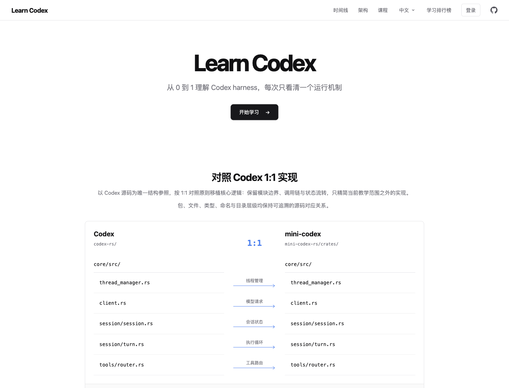

# mini-codex

## [在线学习 Learn Codex →](https://learn-codex.tech/)

**网站地址：[https://learn-codex.tech](https://learn-codex.tech/)**

从 0 到 1 理解 Codex harness，用交互动画和代码运行模拟，看清模型、工具与上下文如何配合。
课程内容无需登录，打开即可学习。

**[进入网站](https://learn-codex.tech/) · [从第一课 Agent Loop 开始](https://learn-codex.tech/lessons/agent-loop)**

[](https://learn-codex.tech/)

*点击首页预览图，直接访问在线教程。*

## 关于项目

这是一个围绕真实 Codex Rust 代码组织方式搭建的教学 monorepo。Rust 执行内核和 React
交互式教学站保持平级，便于一边读代码、一边观察架构状态如何流转。

核心调用链：

```text
ThreadManager
  -> CodexThread
  -> Session / submission_loop
  -> run_turn
  -> ModelClient
  -> ToolRouter
  -> history
```

## 项目结构

教学站前后端支持离线 Docker 部署：`make offline-pack VERSION=v1` 生成包含前端、后台与 PostgreSQL 镜像的 linux/amd64 离线包。上传后运行包内 `bash deploy.sh init`、`bash deploy.sh up`，无需在线拉取镜像。详见 [部署说明](deploy/README.md)，不包含生产密钥或数据库数据。

教学站独立 Go 业务后台位于 `backend/`，使用 Gin、GORM、PostgreSQL，提供 GitHub 登录、PV/UV、章节评论、打卡和学习排行榜，支持 Docker Compose。详见 [后台说明](backend/README.md)。该模块和教学前端一样是明确的项目独有业务，不属于 Codex Rust 内核的 1:1 移植范围。

第二章新增可选 Rust 实验：CodeMirror 6 高亮编辑器、预编译 reqwest/tokio/serde_json、独立 gVisor worker、单任务队列、受控 HTTP 转发与资源限制，默认关闭执行入口，不随普通网站部署自动启用。配置与安全边界见 [Rust 沙箱说明](deploy/rust-sandbox/README.md)。

```text
mini-codex/
├── backend/                # 教学站 Go API：GitHub 登录、统计、评论、打卡与排行
├── mini-codex-rs/          # Rust workspace：协议、配置、核心循环、工具和 CLI
│   ├── Cargo.toml
│   └── crates/             # protocol, config, model-provider-info, utils/home-dir, core, cli, app-server*
├── mini-codex-tui/         # React + Ink，独立 Node.js 界面
├── frontends/Teach/         # Learn Codex：React + GSAP 交互式源码教学站
│   ├── src/animation/       # timeline 生命周期和播放控制
│   ├── src/course/          # 课程目录元数据
│   └── src/lessons/         # 每节课独立的动画场景
├── Makefile                 # 跨项目开发命令
├── README.md
└── README.zh-CN.md
```

Rust 目录的详细模块说明见 [mini-codex-rs/README.md](mini-codex-rs/README.md)，教学站源码在
[frontends/Teach](frontends/Teach)。

## 中文提示词和注释

普通 CLI 的用户可见文案和 system prompt 在 [CLI 入口](mini-codex-rs/crates/cli/src/main.rs) 中定义，
由 CLI 将 system prompt 传给 `ThreadManager`；核心循环不负责界面文案。源码注释只对架构边界、生命周期和安全约束写中文，Rust 标识符、JSON
字段和 Responses API 事件名保持英文，以便与真实代码对应。

## Ink TUI 与 app-server

新增 `mini-codex-tui/`、`crates/app-server/` 和 `crates/app-server-protocol/`。
Ink 使用 stdio JSONL 连接 Rust 服务，再由服务复用 core 的会话与工具循环。

```bash
make tui
```

需要 Node.js 22+、pnpm 11+ 和 Rust；密钥放在 `~/.mini-codex/.env`，`config.toml` 可选，见上文。
支持文本输入、流式消息、工具状态和连续对话；尚无审批、取消或恢复会话。

## 配置：config.toml 与模型选择

与真实 Codex 一致，模型和 provider 来自配置目录下的 `config.toml`，API key 来自 provider 的
`env_key` 指向的环境变量。配置目录默认 `~/.mini-codex`，可用 `MINI_CODEX_HOME` 覆盖
（源项目是 `CODEX_HOME` / `~/.codex`，本项目改名以免覆盖同一台机器上真实 Codex 的配置）。

内建 provider 只有 `deepseek`（`base_url = https://api.deepseek.com`，`env_key = DEEPSEEK_API_KEY`），
内建模型目录见 `mini-codex-rs/crates/models-manager/models.json`（默认 `deepseek-flash`，另有
`deepseek-v4-pro`）。密钥写入 `~/.mini-codex/.env`，启动时由 `crates/arg0` 自动加载
（对应 Codex 的 `~/.codex/.env`；以 `MINI_CODEX_` 开头的键会被忽略）：

```bash
mkdir -p ~/.mini-codex && chmod 700 ~/.mini-codex
printf 'DEEPSEEK_API_KEY=你的_deepseek_key\n' > ~/.mini-codex/.env && chmod 600 ~/.mini-codex/.env
cd mini-codex-rs && cargo run -p mini-codex-cli
```

`~/.mini-codex/` 下各文件分工与 Codex 一致：`config.toml` 存模型与 provider 定义（从不存密钥），
`.env` 存密钥。仍然支持直接 `export DEEPSEEK_API_KEY`。

需要换模型或走代理时再写 `config.toml`：

```toml
model = "deepseek-v4-pro"

[model_providers.deepseek]          # 覆盖内建 provider
base_url = "https://proxy.example.com"
env_key = "DEEPSEEK_API_KEY"
```

Ink 界面中输入 `/model` 会弹出模型列表，选中后通过 `thread/settings/update` 立即作用于当前会话，
并通过 `config/value/write` 写回 `config.toml` 的 `model` 键（保留原有注释与格式）。

加载链为 `arg0::load_dotenv -> find_codex_home -> load_config_as_toml_with_cli_overrides -> Config::load_from_base_config_with_overrides -> OpenAiResponsesClient::from_config`，
对应源项目 `codex-rs/{arg0, utils/home-dir, config, model-provider-info, models-manager, core/src/config}`。
按用户要求取消了源项目的官方 `openai` provider 与 auth.json 登录流程，密钥只来自环境变量。

输入例如：

```text
列出当前目录的文件，并总结这个项目的结构。
```

## 验证

```bash
cargo fmt --all
cargo check --workspace
cargo test --workspace
```

## Learn Codex 交互式教学站

```bash
cd /Users/hfh/Desktop/github/mini-codex/frontends/Teach
pnpm install
pnpm dev
```

也可以在仓库根目录使用 Makefile：

```bash
make install
make teach-dev
make teach-build
make rust-test
make test
```

离线集成测试会让假模型先返回 `exec_command`，执行真实命令，再验证第二次 prompt 携带
`function_call_output`。

Responses API 当前的工具定义、流式响应和函数调用形状见
[官方 API 文档](https://developers.openai.com/api/reference/cli/resources/responses/methods/create)。

## 当前限制

`exec_command` 目前直接执行 shell，尚未实现生产 Codex 的 sandbox、审批、取消、rollout 恢复、
context compaction、MCP 和 subagents。因此不要在不可信 prompt 或敏感目录中运行。

建议后续按以下顺序扩展：

1. `Interrupt` 和 cancellation
2. 工具并行执行
3. approval policy 和 sandbox
4. rollout 持久化与恢复
5. context window 和 compaction
6. pending input 与 turn steering
7. MCP
8. subagents

## TUI 外观与离线演示

Ink 界面采用顶部双栏欢迎区、中央对话视窗和底部固定输入栏。欢迎区使用用户提供的圆形蓝紫色 Codex 应用图标，以半格字符绘制。边框和标题使用
与图标一致的浅蓝紫 → 紫罗兰 → 亮蓝渐变，保留等待动画、回合耗时、消息分层和工具输出折叠。
助手消息按 Markdown 渲染（`mini-codex-tui/src/markdown_render.tsx`，对应 `tui/src/markdown_render.rs`：
标题、列表、引用、代码块、表格、行内样式与链接；未做语法高亮）。
对话视窗跟随最新消息，超出终端高度的旧内容会被裁切；完整上下文仍由 core 保留。
窄终端会切换为紧凑布局。`Tab` 展开或收起工具输出；`/model` 选择模型；`/clear` 只清除界面记录，
不会重置模型上下文；`/exit` 和 `Ctrl+C` 退出。

在 `mini-codex-tui/` 中运行 `pnpm demo`，无需 API Key 即可预览模拟工具和流式回复。
演示模式明确标注为 DEMO，不连接模型、不执行 shell；真实使用仍运行 `make tui`（仓库根目录）。
设置 `MINI_CODEX_REDUCED_MOTION=1` 可关闭装饰动画。没有密钥时，真实模式会显示配置提示，
不会自动切换到演示模式。
