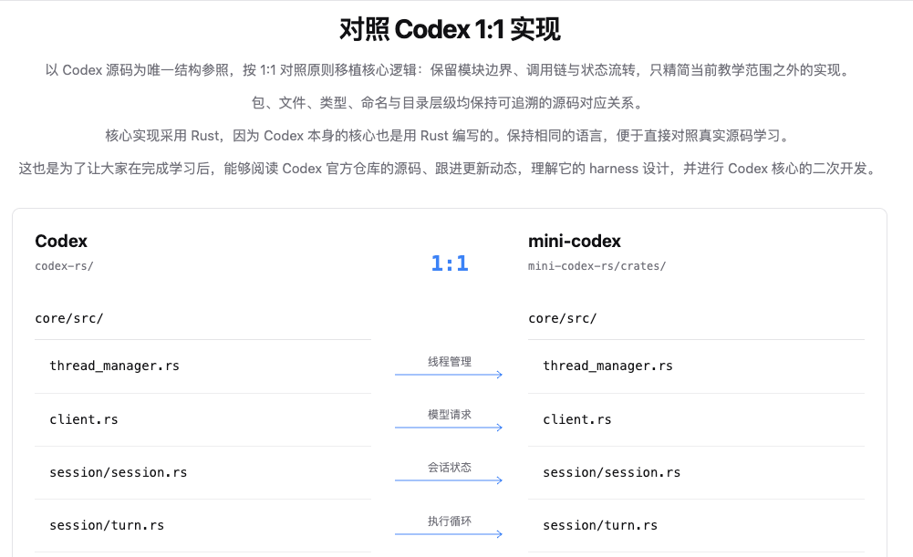

# mini-codex

[简体中文](#简体中文) · [English](#english) · [在线学习 Learn Codex](https://learn-codex.tech/)

## 简体中文

mini-codex 是对 Codex Rust 核心进行简化的教学项目。**核心源码在 [`mini-codex-rs/crates/`](mini-codex-rs/crates/)**；交互式教学站的前端源码在 [`frontends/Teach/src/`](frontends/Teach/src/)，业务后台在 [`backend/`](backend/)。

| 目录 | 主要职责 |
| --- | --- |
| [`mini-codex-rs/crates/protocol/`](mini-codex-rs/crates/protocol/) | 跨层传递的操作、事件和协议类型。 |
| [`mini-codex-rs/crates/tools/`](mini-codex-rs/crates/tools/) | 与源 `codex-rs/tools` 对齐的工具协议、执行契约和 Responses API 工具定义。 |
| [`mini-codex-rs/crates/core/`](mini-codex-rs/crates/core/) | 会话与 turn 循环、模型客户端、上下文和工具调度；主要执行逻辑在这里。 |
| [`mini-codex-rs/crates/config/`](mini-codex-rs/crates/config/) | 配置文件的读取与合并。 |
| [`mini-codex-rs/crates/model-provider-info/`](mini-codex-rs/crates/model-provider-info/) | 模型服务商信息。 |
| [`mini-codex-rs/crates/models-manager/`](mini-codex-rs/crates/models-manager/) | 模型目录和模型选择。 |
| [`mini-codex-rs/crates/arg0/`](mini-codex-rs/crates/arg0/) | 启动时加载本地环境变量。 |
| [`mini-codex-rs/crates/utils/home-dir/`](mini-codex-rs/crates/utils/home-dir/) | 定位配置目录。 |
| [`mini-codex-rs/crates/cli/`](mini-codex-rs/crates/cli/) | 命令行入口。 |
| [`mini-codex-rs/crates/app-server/`](mini-codex-rs/crates/app-server/) | 服务入口和请求处理。 |
| [`mini-codex-rs/crates/app-server-protocol/`](mini-codex-rs/crates/app-server-protocol/) | 服务对外使用的协议类型。 |
| [`frontends/Teach/src/`](frontends/Teach/src/) | Learn Codex 课程页面、交互演示和通用界面。 |
| [`backend/`](backend/) | 教学站的账号、评论、学习进度和统计等业务 API；与 Rust 内核独立。 |
| [`deploy/`](deploy/) | 教学站的部署配置与脚本。 |

Rust 目录与上游 Codex 的对应关系是 `codex-rs/<crate>/` → `mini-codex-rs/crates/<crate>/`。要从主调用链开始阅读，可依次看 [`thread_manager.rs`](mini-codex-rs/crates/core/src/thread_manager.rs)、[`session/turn.rs`](mini-codex-rs/crates/core/src/session/turn.rs) 和 [`tools/router.rs`](mini-codex-rs/crates/core/src/tools/router.rs)。

## English

mini-codex is a teaching project that simplifies the Codex Rust core. **The core source is in [`mini-codex-rs/crates/`](mini-codex-rs/crates/)**. The interactive learning site lives in [`frontends/Teach/src/`](frontends/Teach/src/), with its separate business API in [`backend/`](backend/).

| Directory | Purpose |
| --- | --- |
| [`mini-codex-rs/crates/protocol/`](mini-codex-rs/crates/protocol/) | Operations, events, and protocol types shared across layers. |
| [`mini-codex-rs/crates/tools/`](mini-codex-rs/crates/tools/) | Tool primitives, execution contracts, and Responses API tool definitions mapped from upstream `codex-rs/tools`. |
| [`mini-codex-rs/crates/core/`](mini-codex-rs/crates/core/) | Sessions, the turn loop, model client, context, and tool routing; the main execution logic. |
| [`mini-codex-rs/crates/config/`](mini-codex-rs/crates/config/) | Loading and merging configuration. |
| [`mini-codex-rs/crates/model-provider-info/`](mini-codex-rs/crates/model-provider-info/) | Model provider definitions. |
| [`mini-codex-rs/crates/models-manager/`](mini-codex-rs/crates/models-manager/) | Model catalog and selection. |
| [`mini-codex-rs/crates/arg0/`](mini-codex-rs/crates/arg0/) | Loading local environment variables at startup. |
| [`mini-codex-rs/crates/utils/home-dir/`](mini-codex-rs/crates/utils/home-dir/) | Finding the configuration directory. |
| [`mini-codex-rs/crates/cli/`](mini-codex-rs/crates/cli/) | Command-line entry point. |
| [`mini-codex-rs/crates/app-server/`](mini-codex-rs/crates/app-server/) | Service entry point and request handling. |
| [`mini-codex-rs/crates/app-server-protocol/`](mini-codex-rs/crates/app-server-protocol/) | External service protocol types. |
| [`frontends/Teach/src/`](frontends/Teach/src/) | Learn Codex lessons, interactive demonstrations, and shared UI. |
| [`backend/`](backend/) | Site APIs for accounts, comments, learning progress, and statistics; separate from the Rust core. |
| [`deploy/`](deploy/) | Deployment configuration and scripts for the learning site. |

Rust directories map to upstream Codex as `codex-rs/<crate>/` → `mini-codex-rs/crates/<crate>/`. To follow the main execution path, start with [`thread_manager.rs`](mini-codex-rs/crates/core/src/thread_manager.rs), [`session/turn.rs`](mini-codex-rs/crates/core/src/session/turn.rs), and [`tools/router.rs`](mini-codex-rs/crates/core/src/tools/router.rs).
